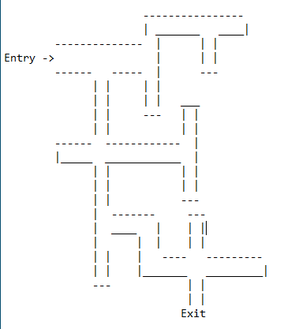
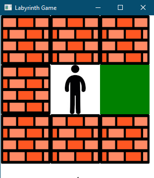

# Labyrinth Game

## Opis

Prosta gra napisana w języku Java w celu przećwiczenia wzorców projektowych: Builder, Fabryka abstrakcyjna, Singleton. Gracz ma za zadanie wydostać się z labiryntu widząc zaledwie mały fragment mapy.

## Technologie

* Java
* JavaFX

## Wzorce projektowe

* Builder
* Fabryka abstrakcyjna
* Singleton

## Wygląd gry

1. Mapa demonstracyjnego labiryntu

2. Wygląd samej gry - gracz widzi zaledwie mały fragment mapy, nie zna natomiast całej mapy.

